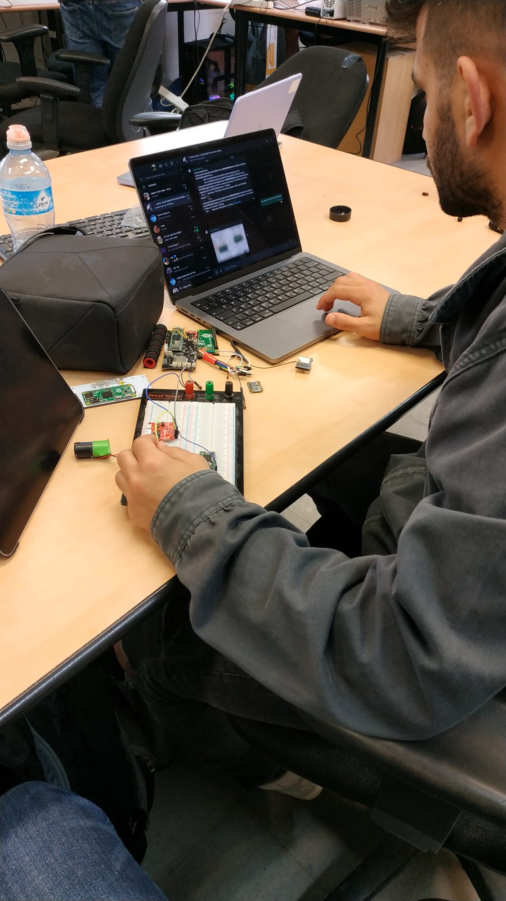
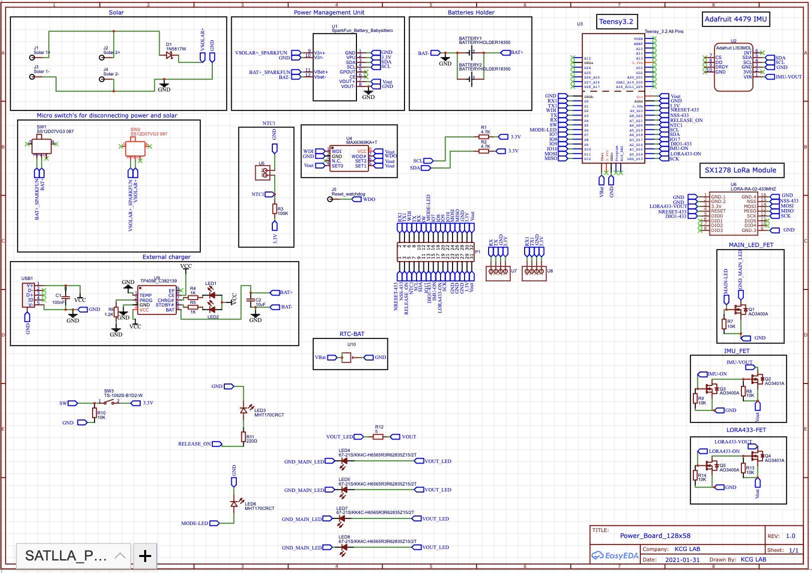
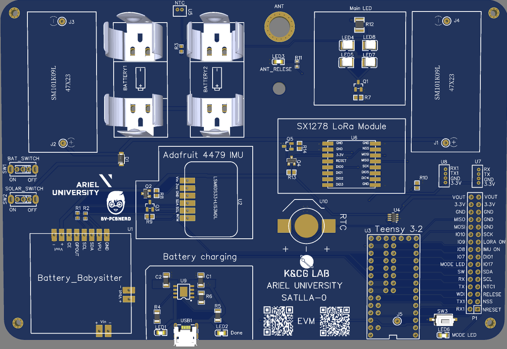

# Intro To Space Engineering Course At Ariel University

<u>Final Board</u>

### Our project is pico-satellite 1P (based on STALLA0)

Made by : 
* Or Mendel - 315524389
* Eran Levy - 311382360
* Omer Michael - 316334671

With the help of :
* Roni Ronen
* Michael Britvin

## Satellite Components

* Teensy 3.2
* SX1278 LoRa Module 433
* Adafruit 4479 IMU
* 18350 litium ion keepower
* SparkFun Battery Babysitter

## The steps during the construction of the satellite

1.  - Initial construction
    
    
    
    Initial construction was to plan the satellite on a matrix that
    simulates an electrical circuit in order to make sure that all the components are connected to their correct pins
    
    
 2. - Diagram in EasyEDA
    
    
    We had to take the design from the matrix and implement it on a dedicated website called EasyEDA

3. - 3D diagram
    
   

## Here will be the Demo Video
<video width="320" height="240" controls>
  <source src="./example.mp4" type="video/mp4">
Your browser does not support the video tag.
</video>
<u> Demo video </u>

